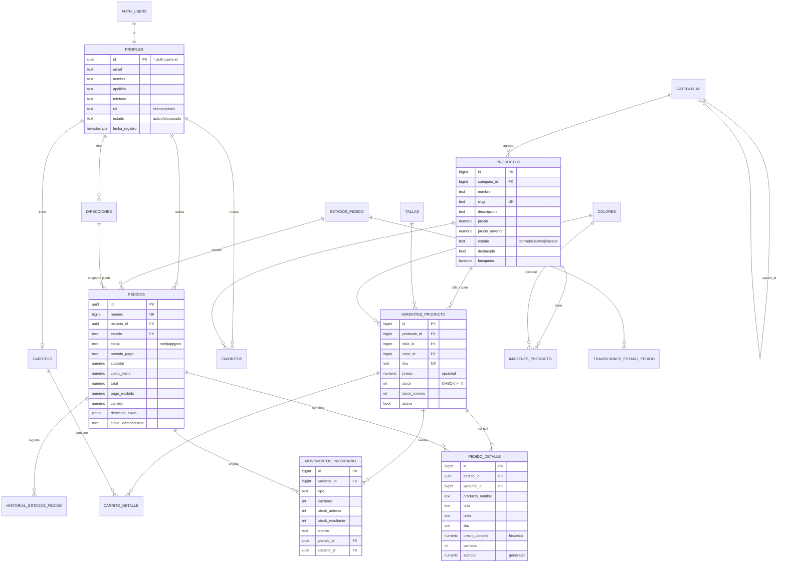

# Base de datos (PostgreSQL · Supabase)

## 1. Origen

El proyecto original **no tenía base de datos** (ni MySQL ni MariaDB): todo se
guardaba en el `localStorage` del navegador y las contraseñas en archivos JSON.
No existía información real que migrar; la estructura implícita
(`{id, imagen, cantidad, talla, color, precio}`) se **normalizó** en el modelo
siguiente y las 20 fotografías originales se cargaron como catálogo de prueba.
Detalle en [ANALISIS_PROYECTO_ORIGINAL.md](ANALISIS_PROYECTO_ORIGINAL.md).

## 2. Migraciones

| Archivo | Contenido |
|---|---|
| `001_initial_schema.sql` | Extensiones, esquema privado `app_private`, `set_updated_at`, `slugify`, rate limiting |
| `002_profiles.sql` | `profiles` (1:1 con `auth.users`), `is_admin()`, `is_active_user()`, trigger de alta, protección de rol, `direcciones` |
| `003_products.sql` | `categorias`, `tallas`, `colores`, `productos`, `variantes_producto`, `imagenes_producto`, `movimientos_inventario`, `favoritos`, `configuracion_tienda`, vista `v_catalogo_productos` |
| `004_orders.sql` | `estados_pedido`, `transiciones_estado_pedido`, `carritos`, `carrito_detalle`, `pedidos`, `pedido_detalle`, `historial_estados_pedido` y funciones de negocio |
| `005_rls.sql` | `REVOKE`/`GRANT` mínimos, RLS en todas las tablas y políticas |
| `006_storage.sql` | Bucket `productos` y políticas de `storage.objects` |
| `007_reports.sql` | Funciones de reportes y endurecimiento de `app_private` |
| `seed.sql` | 6 categorías, 12 tallas, 9 colores, 20 productos, 98 variantes, imágenes, kardex inicial |

Reconstrucción: `npx supabase db reset` (Supabase CLI) o `scripts/local/dev-env.sh reset`.

## 3. Diagrama entidad–relación

## 4. Tablas

| Tabla | Propósito | Claves / restricciones destacadas |
|---|---|---|
| `profiles` | Datos personales, rol y estado del usuario de Supabase Auth | PK = FK `auth.users(id)` `on delete cascade`; `rol` y `estado` con CHECK |
| `direcciones` | Direcciones de envío | Índice único parcial: una sola `es_principal` por usuario |
| `categorias` | Categorías (y subcategorías) | `slug` único, `activa`, `orden` |
| `tallas`, `colores` | Catálogos maestros | `codigo` / `nombre` únicos, `hex` validado |
| `productos` | Producto base | `precio > 0`, `precio_anterior > precio`, `tsvector` generado + GIN, trigramas |
| `variantes_producto` | Talla × color con **stock propio** | UNIQUE(producto, talla, color), `sku` único, `stock >= 0` |
| `imagenes_producto` | Imágenes (Storage) | Una principal por producto; `color_id` opcional |
| `movimientos_inventario` | Kardex (auditoría de stock) | CHECK `stock_resultante = stock_anterior + cantidad` |
| `favoritos` | Lista de deseos | PK compuesta (usuario, producto) |
| `configuracion_tienda` | Contenido/parámetros editables | Clave/valor `jsonb`, bandera `publica` |
| `estados_pedido`, `transiciones_estado_pedido` | Máquina de estados de pedidos como **datos** | FK entre estados |
| `carritos`, `carrito_detalle` | Carrito persistente | Un carrito por usuario; cantidad 1–20; sin precios |
| `pedidos` | Cabecera del pedido | CHECK `total = subtotal + envío − descuento`; idempotencia única por usuario; `numero` legible |
| `pedido_detalle` | Líneas con **precio histórico** | Copia nombre/talla/color/SKU; `subtotal` generado |
| `historial_estados_pedido` | Trazabilidad de estados | Quién, cuándo, comentario |
| `app_private.rate_limits` | Rate limiting | Esquema no expuesto |

> **¿Por qué no existe una tabla `inventario` separada?** El stock vive en
> `variantes_producto.stock` (fuente única de verdad, con `CHECK >= 0` y
> bloqueo de fila) y cada cambio se registra en `movimientos_inventario`.
> Una tabla `inventario` paralela duplicaría el dato y podría desincronizarse.

## 5. Funciones (RPC)

| Función | Quién | Descripción |
|---|---|---|
| `crear_pedido(direccion, metodo_pago, notas, clave, canal)` | cliente | Checkout atómico (ver ARQUITECTURA §3) |
| `cancelar_mi_pedido(id)` | cliente | Solo pedidos propios en `pendiente`; repone stock |
| `admin_cambiar_estado_pedido(id, estado, comentario)` | admin | Respeta transiciones; `cancelado` repone stock |
| `admin_ajustar_inventario(variante, cantidad, tipo, motivo)` | admin | Único camino para modificar stock manualmente |
| `admin_registrar_venta_pos(items, pago, metodo, cliente)` | admin | Venta en tienda con cálculo de cambio |
| `admin_resumen_dashboard()`, `admin_reporte_*()` | admin | Estadísticas calculadas al vuelo |
| `is_admin()`, `is_active_user()` | todos | Usadas por las políticas RLS |

Funciones internas en `app_private` (`procesar_lineas_pedido`, `mover_stock`,
`reponer_inventario_pedido`, …) **no son invocables** por `anon`/`authenticated`.

## 6. Row Level Security (resumen)

RLS está **activado en las 18 tablas** del esquema `public`. Detalle completo
de políticas y privilegios en [SEGURIDAD.md](SEGURIDAD.md#3-row-level-security).

| Tabla | SELECT | INSERT | UPDATE | DELETE |
|---|---|---|---|---|
| profiles | propio / admin | — (trigger) | propio (nombre, apellido, teléfono) / admin (rol, estado) | — |
| direcciones | propias / admin | propias | propias | propias |
| categorias | activas / admin | admin | admin | admin |
| tallas, colores | todos | admin | admin | admin |
| productos | activos / admin | admin | admin | admin |
| variantes_producto | activas de productos activos / admin | admin (sin `stock`) | admin (sin `stock`) | admin |
| imagenes_producto | de productos activos / admin | admin | admin | admin |
| movimientos_inventario | admin | — (funciones) | — | — |
| favoritos | propios | propios | — | propios |
| configuracion_tienda | públicas / admin | — | admin | — |
| estados_pedido, transiciones | todos | — | — | — |
| carritos | propio | propio (activo) | — | propio |
| carrito_detalle | propio | propio | propio (`cantidad`) | propio |
| pedidos | propios / admin | — (funciones) | — (funciones) | — |
| pedido_detalle, historial | del pedido visible | — | — | — |

## 7. Datos de prueba

* `supabase/seed.sql`: 6 categorías (Camisetas, Pantalones, Sudaderas,
  Chaquetas, Conjuntos, Accesorios), 20 productos con las fotos originales,
  98 variantes con cantidades variadas (incluye agotadas y stock bajo).
* `scripts/seed_demo.php`: 5 usuarios creados con la API de Supabase Auth,
  direcciones, carritos, 18 pedidos web en distintos estados y 6 ventas en
  tienda, repartidos en los últimos 90 días.

| Usuario | Rol | Contraseña de demostración |
|---|---|---|
| admin@firecat.test | admin | `FireCat-Demo-2026` (configurable con `DEMO_PASSWORD`) |
| camila@ / andres@ / valentina@ / santiago@firecat.test | cliente | ídem |

> Son cuentas ficticias de dominio `.test`, solo para desarrollo.
