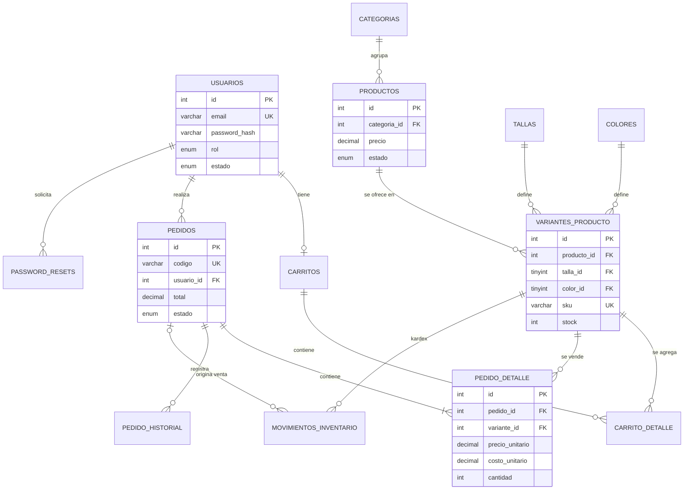
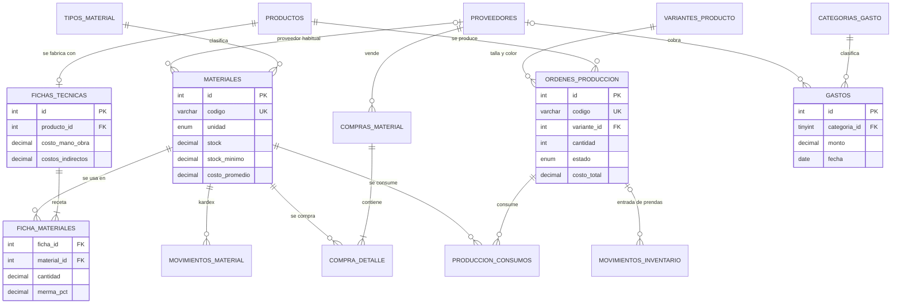

# Base de datos `tienda_ropa`

Motor InnoDB (transacciones y claves foráneas) · `utf8mb4_unicode_ci` · MariaDB 10.4+ (XAMPP) o MySQL 8.0+ ·
script completo en [`database.sql`](../database.sql). **27 tablas + 1 vista**, en tres módulos: tienda,
fabricación y finanzas.

## Modelo entidad-relación: tienda

## Modelo entidad-relación: fabricación y finanzas

## Tablas

### Tienda

| Tabla | Propósito | Claves y restricciones destacadas |
|---|---|---|
| `usuarios` | Clientes y administradores | `email` UNIQUE · `rol` ENUM(`administrador`,`cliente`) · `estado` ENUM · `debe_cambiar_password` |
| `password_resets` | Tokens de recuperación de contraseña | Sólo el **hash SHA-256** del token · `expira` · `usado` · FK → usuarios (CASCADE) |
| `intentos_login` | Limitación de fuerza bruta | Índices por (email, fecha) e (ip, fecha) |
| `categorias` | Camisetas, Pantalones, Sudaderas… | `nombre` UNIQUE · `estado` |
| `tallas` / `colores` | Catálogos de atributos (normalización) | `nombre` UNIQUE · `orden` / `codigo_hex` |
| `productos` | Prenda "padre" | FK → categorias (RESTRICT) · CHECK `precio > 0` |
| `variantes_producto` | Producto + talla + color con **stock propio** | UNIQUE(producto, talla, color) · `sku` UNIQUE · CHECK `stock >= 0` |
| `carritos` | Un carrito por usuario | `usuario_id` UNIQUE |
| `carrito_detalle` | Líneas del carrito | UNIQUE(carrito, variante) · CHECK `cantidad > 0` · `precio_unitario` sólo referencial |
| `pedidos` | Cabecera del pedido | `codigo` UNIQUE (FC-000001) · estados ENUM · datos de entrega copiados · `pago_con` (efectivo) |
| `pedido_detalle` | Líneas del pedido | **Snapshot**: nombre, talla, color, `precio_unitario` y `costo_unitario` históricos |
| `pedido_historial` | Trazabilidad de estados | estado anterior → nuevo, usuario, comentario, fecha |
| `movimientos_inventario` | Kardex de prendas | tipo (entrada, salida, ajuste, venta, devolución, **producción**), cantidad ±, saldo, pedido u orden |
| `configuracion` | Ajustes clave → valor | costo de envío, envío gratis desde, umbral de stock bajo… |
| `vista_stock_productos` (VIEW) | Stock total por producto | Agrega las variantes activas |

### Fabricación

| Tabla | Propósito | Claves y restricciones destacadas |
|---|---|---|
| `proveedores` | A quién se le compra | `nombre` y `nit` UNIQUE · `estado` |
| `tipos_material` | Telas, Hilos, Botones, Cierres, Etiquetas y empaque, Otros insumos | `nombre` UNIQUE |
| `materiales` | Materias primas | `codigo` y `nombre` UNIQUE · `unidad` ENUM (metro, unidad, cono, kg…) · `stock` y `stock_minimo` DECIMAL(12,3) · **`costo_promedio`** · CHECK ≥ 0 |
| `compras_material` | Cabecera de la compra | `codigo` UNIQUE (CM-000001) · FK → proveedores (RESTRICT) · `estado` (recibida/anulada) |
| `compra_detalle` | Materiales comprados | FK → compra (CASCADE) y material (RESTRICT) · CHECK `cantidad > 0` |
| `movimientos_material` | Kardex de materias primas | tipo (compra, consumo, ajuste, devolución, anulación) · cantidad ± · saldo · costo · compra u orden |
| `fichas_tecnicas` | Receta de una prenda | `producto_id` UNIQUE · mano de obra, indirectos, tiempo |
| `ficha_materiales` | Material × cantidad por prenda | UNIQUE(ficha, material) · CHECK `cantidad > 0` y `merma_pct` 0–100 |
| `ordenes_produccion` | Lote a fabricar | `codigo` UNIQUE (OP-000001) · estado ENUM · costos (materiales, mano de obra, indirectos, total, unitario) |
| `produccion_consumos` | Consumo **real** de cada orden | cantidad, costo unitario del momento y subtotal |

### Finanzas

| Tabla | Propósito | Claves y restricciones destacadas |
|---|---|---|
| `categorias_gasto` | Arriendo, Servicios, Mantenimiento de maquinaria… | `nombre` UNIQUE · `grupo` ENUM(operativo, mantenimiento, otro) |
| `gastos` | Cada gasto pagado | FK → categoría (RESTRICT) · CHECK `monto > 0` · fecha, método de pago, comprobante |

## Reglas de negocio e integridad

- **Precio y costo históricos**: al confirmar un pedido, `pedido_detalle` copia el `precio` del producto **y su costo de
  fabricación** (ficha técnica). Cambios posteriores no alteran pedidos antiguos (el pedido `FC-000201` de la demo se
  compró a $49.900 y hoy la camiseta vale $54.900).
- **Transacción de compra del cliente** (`includes/pedidos.php::crear_pedido`):
  `BEGIN` → `SELECT … FOR UPDATE` de las variantes del carrito → validar stock y estado → `INSERT pedidos` →
  `INSERT pedido_detalle` → `UPDATE variantes_producto` + `INSERT movimientos_inventario` → `INSERT pedido_historial` →
  `DELETE carrito_detalle` → `COMMIT`. Ante cualquier error: `ROLLBACK`.
- **Costo promedio ponderado** (`includes/fabricacion.php::mover_material`): en cada compra,
  `nuevo = (stock × costo_actual + cantidad × costo_compra) / (stock + cantidad)`.
- **Costo de fabricación** de una prenda: `Σ cantidad × (1 + merma %) × costo_promedio + mano de obra + indirectos`.
- **Producción en transacción**: al *iniciar* una orden se bloquean los materiales (`FOR UPDATE`), se verifica que
  alcancen **todos**, se descuentan, se registra el consumo real y su costo; si falta uno: `ROLLBACK` y no se descuenta
  nada. Al *terminar*, las prendas entran a `variantes_producto` con un movimiento `produccion`. Cancelar una orden en
  proceso devuelve los materiales.
- **Utilidad estimada** = ventas − costo de lo vendido − gastos. **Flujo de dinero** = dinero cobrado − compras −
  gastos. Comprar material es salida de dinero pero no costo, hasta que la prenda se vende.
- **Borrado seguro**: productos con ventas, categorías con productos, proveedores con compras y materiales usados en
  compras, fichas o producción no se eliminan (`RESTRICT`); se desactivan.
- **Flujo de estados**: pedidos pendiente → confirmado → preparado → enviado → entregado (cancelable hasta *preparado*);
  órdenes planificada → en proceso → terminada (cancelable antes de terminar). El servidor rechaza otras transiciones.
- **Kardex consistente**: en los datos de demostración la suma de movimientos de cada variante y de cada material es
  igual a su stock, y el saldo de cada movimiento se calcula en orden cronológico.
