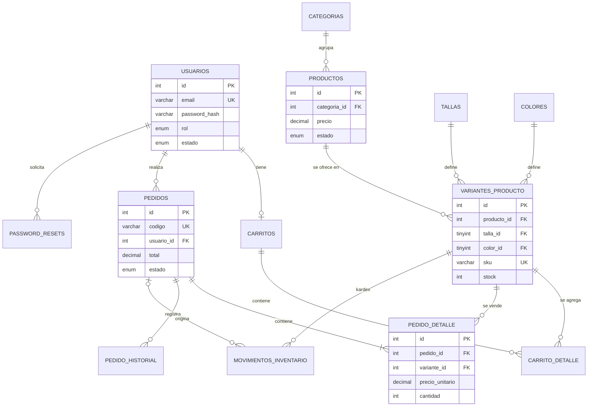

# Base de datos `tienda_ropa`

Motor InnoDB (transacciones y claves foráneas) · `utf8mb4_unicode_ci` · script completo en [`database.sql`](../database.sql).

## Modelo entidad-relación

## Tablas

| Tabla | Propósito | Claves y restricciones destacadas |
|---|---|---|
| `usuarios` | Clientes y administradores | `email` UNIQUE · `rol` ENUM(`administrador`,`cliente`) · `estado` ENUM · `debe_cambiar_password` |
| `password_resets` | Tokens de recuperación de contraseña | Sólo el **hash SHA-256** del token · `expira` · `usado` · FK → usuarios (CASCADE) |
| `intentos_login` | Limitación de fuerza bruta | Índices por (email, fecha) e (ip, fecha) |
| `categorias` | Camisetas, Pantalones, Sudaderas… | `nombre` UNIQUE · `estado` |
| `tallas` / `colores` | Catálogos de atributos (normalización) | `nombre` UNIQUE · `orden` / `codigo_hex` |
| `productos` | Prenda "padre" | FK → categorias (RESTRICT) · CHECK `precio > 0` |
| `variantes_producto` | Producto + talla + color con **stock propio** | UNIQUE(producto, talla, color) · `sku` UNIQUE · CHECK `stock >= 0` |
| `carritos` | Un carrito por usuario | `usuario_id` UNIQUE |
| `carrito_detalle` | Líneas del carrito | UNIQUE(carrito, variante) · CHECK `cantidad > 0` · `precio_unitario` sólo referencial |
| `pedidos` | Cabecera del pedido | `codigo` UNIQUE (FC-000001) · estados ENUM · datos de entrega copiados · `pago_con` (efectivo) |
| `pedido_detalle` | Líneas del pedido | **Snapshot**: nombre, talla, color y `precio_unitario` históricos |
| `pedido_historial` | Trazabilidad de estados | estado anterior → nuevo, usuario, comentario, fecha |
| `movimientos_inventario` | Kardex | tipo (entrada, salida, ajuste, venta, devolución), cantidad ±, stock resultante, pedido |
| `configuracion` | Ajustes clave → valor | costo de envío, envío gratis desde, umbral de stock bajo… |
| `vista_stock_productos` (VIEW) | Stock total por producto | Agrega las variantes activas |

## Reglas de integridad

- **Precio histórico**: `pedido_detalle.precio_unitario` se copia de `productos.precio` al confirmar; editar el precio
  después no altera pedidos antiguos (el pedido `FC-000001` de la demo se compró a $49.900 y hoy el producto vale $54.900).
- **Borrado seguro**: `pedido_detalle → productos/variantes` es `RESTRICT`: un producto con ventas no puede eliminarse,
  sólo desactivarse. Una categoría con productos tampoco.
- **Transacción de compra** (`includes/pedidos.php::crear_pedido`):
  `BEGIN` → `SELECT … FOR UPDATE` de las variantes del carrito → validar stock y estado → `INSERT pedidos` →
  `INSERT pedido_detalle` (precio histórico) → `UPDATE variantes_producto` (descontar) + `INSERT movimientos_inventario`
  → `INSERT pedido_historial` → `DELETE carrito_detalle` → `COMMIT`. Ante cualquier error: `ROLLBACK`.
- **Cancelación**: devuelve el stock dentro de otra transacción (movimiento `devolucion`).
- **Flujo de estados**: pendiente → confirmado → preparado → enviado → entregado; se puede cancelar hasta *preparado*.
  El servidor rechaza cualquier otra transición.
